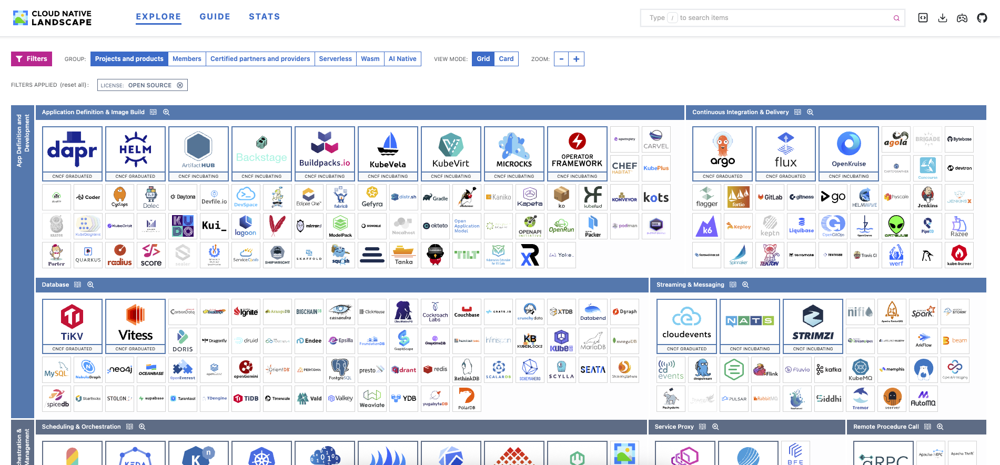

Bienvenido a **Stack Kitchen.**  Recetas, arquitecturas e implementaciones probadas en batalla, desde los cimientos de Kubernetes hasta Inteligencia Artificial.
Diseñado para ingenieros que buscan agilidad.  Stack Kitchen permite desplegar desde entornos de pruebas (Sandbox) hasta arquitecturas de **Alta Disponibilidad** (HA) en cuestión de minutos. 

Todo el código sigue las mejores prácticas de **SRE**, **DevOps**, **Ingeniería de Datos** y **ML**, garantizando infraestructuras seguras y resilientes.
Muchas de las buenas practicas y herramientas son parte del Cloud Native Landscape

##Cloud Native Landscape

Es el "mapa" oficial mantenido por la **CNCF (Cloud Native Computing Foundation)** que organiza el inmenso ecosistema de herramientas necesarias para construir, desplegar y gestionar aplicaciones modernas en la nube.  Es la guía definitiva para pasar de servidores tradicionales a arquitecturas de microservicios, contenedores y automatización.

[https://landscape.cncf.io/](https://landscape.cncf.io/)
{ align=center width="100%" }