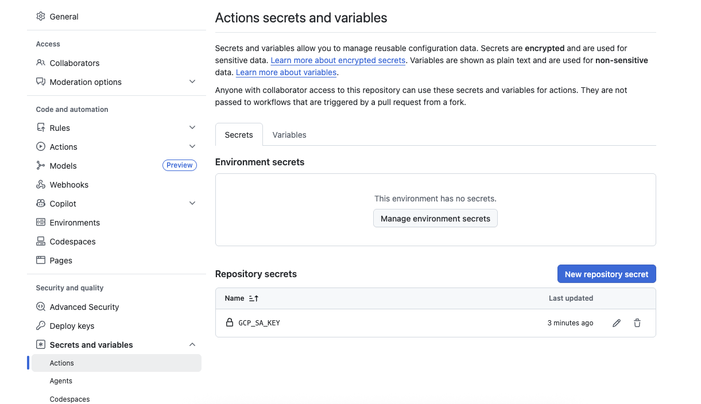

# Infraestructura como Código (IaC)

Esta sección centralizo plantillas de :simple-terraform: [Terraform](https://www.terraform.io/)  diseñadas para la creacion de recursos de infraestructura segura en [Google Cloud](https://cloud.google.com/), asi como en On-Prem usando :simple-ansible: [Ansible](https://docs.ansible.com/), también github actions y github packages para la orquestación de flujos de trabajo.

## 1. Implementación de infraestructura en la nube
### Acceso al Código
El código fuente completo se encuentra en el repositorio `iac_gke`, y se ha optado por estructurar el repositorio de manera modular con Terragrunt para permitir la reutilización en diferentes entornos (Dev, Staging, Prod).

[Código Fuente en GitHub :octicons-link-external-16:](https://github.com/mcatalangt/iac_gke.git){ .md-button  }

### Especificaciones Técnicas 

|Tipo|Provider|Nodos| Tipo de nodo    |Specs| Memoria RAM |
| :--- | :--- | :--- | :--- | :--- | :--- |
| Basic GKE | GCP |2| n1-standard-2 | 2 vCPU| 7.5 GB |

## 2. On-Prem Infrastructure Deployment
## 3. Stack (Los ingredientes)
!!! info "Herramientas"
    * **Cloud:** Google Cloud Platform (GCP) [GKE, Compute Engine]
    * **Herramienta:** Terraform v1.5+, Terragrunt, Ansible, GitHub Actions, Github Package
    * **Seguridad:** IAM Least Privilege, VPC Service Controls
## 4. Arquitectura
El código está modularizado para permitir la reutilización en diferentes entornos (Dev, Staging, Prod) en Cloud y On-Prem.

{ align=center width="100%" }

## 5. Paso a Paso

### Pre-requisitos

- Descargar el codigo de la repositorio
```bash
git clone https://github.com/mcatalangt/iac_gke.git
```
- Crear una llave service acount en GCP y colocarla como secret en GH ACTIONS
  
    - Ve a la Consola de Google Cloud.
    - Asegúrate de estar en el Proyecto correcto (menú desplegable en la barra superior).
    - En el menú de navegación izquierdo, ve a IAM y administración (IAM & Admin) > Cuentas de servicio (Service Accounts).
    - Busca en la lista la Service Account a la que le quieres crear la llave y haz clic en su dirección de correo (o crea una nueva si no existe).
    - En la parte superior, navega a la pestaña Claves (Keys).
    - Haz clic en el botón Agregar clave (Add Key) y selecciona Crear clave nueva (Create new key).
    - Elige el tipo de clave JSON (es el estándar de la industria) y haz clic en Crear.
     - El archivo .json se descargará automáticamente a tu computadora.
     - Crea un repositorio en GitHub y coloca la llave en los secrets
     { align=center width="100%" }
    
- Crear 2 variables de entorno en GitHub
  - GCP_PROJECT: Coloca el id del proyecto en GCP
  - GCP_REGION: Coloca el nombre de la region o zona en GCP (ej. us-central1)
  { align=center width="100%" }

## 6. Validación E2E

## 7. Otros Módulos Incluidos

| Módulo| Descripción |Estado| Repositorio |
| :--- | :--- | :--- | :--- |
| `01-iac-postgresql` | Creación de BD PostgreSQL HA. | ✅ Stable | [GitHub :octicons-link-external-16:](https://github.com/mcatalangt/data-reliability-hub/tree/main/01-iac-postgresql) |
| `02-iac-mysql` | Creación de BD MySQL HA. | ✅ Stable | [GitHub :octicons-link-external-16:](https://github.com/mcatalangt/data-reliability-hub/tree/main/01-iac-postgresql) |
| `03-iac-mongodb` | Creación de BD MongoDB HA. | ✅ Stable | [GitHub :octicons-link-external-16:](https://github.com/mcatalangt/data-reliability-hub/tree/main/01-iac-postgresql) |
| `04-iac-neo4j` | Creación de BD Neo4J HA. | ✅ Stable | [GitHub :octicons-link-external-16:](https://github.com/mcatalangt/data-reliability-hub/tree/main/01-iac-postgresql) |
| `05-iac-prefect` | Creación de Workflow Prefect, orquestador y automatizador de flujos de trabajo| 🚧 Beta | [GitHub :octicons-link-external-16:](https://github.com/mcatalangt/data-reliability-hub/tree/main/02-iac-prefect) |
| `06-iac-event-driven` | Creación de event driven (PubSub, Kafka, RabbitMQ) para gestión de mensajes y desacoplamiento de sistemas| 🚧 Beta | [GitHub :octicons-link-external-16:](https://github.com/mcatalangt/data-reliability-hub/tree/main/03-iac-event-driven) |
| `07-iac-kubernetes` | Creación de Kubernetes en GKE, Orquestador de Contenedores en 5 minutos| ✅ Stable | [GitHub :octicons-link-external-16:](https://github.com/mcatalangt/data-reliability-hub/tree/main/04-iac-kubernetes) |
| `08-iac-observability` | Creación de Grafana Stack en GKE para Observabilidad de sistemas transacionales E2E (Logs, Trazas, Metricas y Perfiles)| 🚧 Beta | [GitHub :octicons-link-external-16:](https://github.com/mcatalangt/data-reliability-hub/tree/main/05-iac-observability) |


