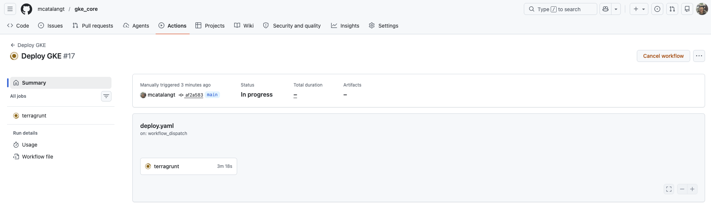
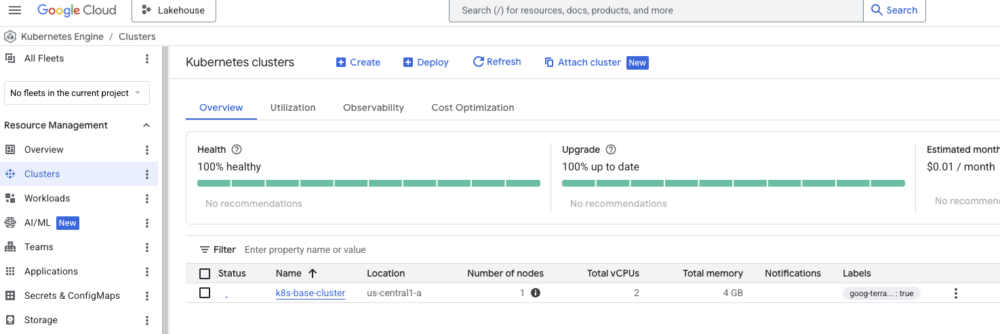
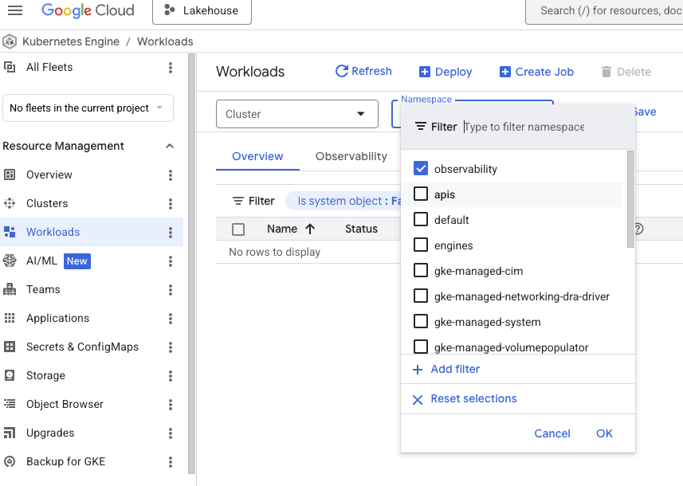

# Infraestructura como Código (IaC)

Esta sección centralizo plantillas de :simple-terraform: [Terraform](https://www.terraform.io/)  diseñadas para la creacion de recursos de infraestructura segura en [Google Cloud](https://cloud.google.com/), asi como en On-Prem usando :simple-ansible: [Ansible](https://docs.ansible.com/), también github actions y github packages para la orquestación de flujos de trabajo.

## 1. Implementación de infraestructura en la nube
### Acceso al Código
El código fuente completo se encuentra en el repositorio `iac_gke`, y se ha optado por estructurar el repositorio de manera modular con Terragrunt para permitir la reutilización en diferentes entornos (Dev, Staging, Prod).

[Código Fuente en GitHub :octicons-link-external-16:](https://github.com/mcatalangt/iac_gke.git){ .md-button  }

### Especificaciones Técnicas 

|Tipo|Provider|Nodos| Tipo de nodo    |Specs| Memoria RAM |
| :--- | :--- | :--- | :--- | :--- | :--- |
| Basic GKE | GCP |2| n1-standard-2 | 2 vCPU| 7.5 GB |

## 2. On-Prem Infrastructure Deployment
## 3. Stack (Los ingredientes)
!!! note "Herramientas"
    * **Cloud:** Google Cloud Platform (GCP) [GKE, Compute Engine]
    * **Herramienta:** Terraform v1.5+, Terragrunt, Ansible, GitHub Actions, Github Package
    * **Seguridad:** IAM Least Privilege, VPC Service Controls
## 4. Arquitectura
El código está modularizado para permitir la reutilización en diferentes entornos (Dev, Staging, Prod) en Cloud y On-Prem.

##### Estructura del repositorio:
Estoy usando el patrón de diseño DRY (Don't Repeat Yourself) de Terragrunt, el cual separa la configuración global de la configuración específica de cada módulo.

<div style="font-size: 0.75rem; line-height: 1.2;">

```text
📦 iac_core    --- Repositorio Base
 ┣ 📂 .github
 ┃ ┗ 📂 workflows
 ┃   ┣ 📜 deploy.yaml  --- Workflow para despliegue de infraestructura
 ┃   ┗ 📜 destroy.yaml --- Workflow para destrucción de infraestructura
 ┣ 📂 live
 ┃ ┣ 📂 desarrollo
 ┃ ┃ ┣ 📂 gke-base
 ┃ ┃ ┃ ┗ 📜 terragrunt.hcl    ---  Configuración terragrunt para el clúster base
 ┃ ┃ ┗ 📂 gke-resources
 ┃ ┃   ┗ 📜 terragrunt.hcl    ---  Configuración terragrunt para recursos internos (namespaces, etc)
 ┃ ┗ 📜 terragrunt.hcl        ---  Configuración terragrunt global ROOT (Estado y Providers)
 ┣ 📂 modules
 ┃ ┗ 📂 gke-base
 ┃   ┗ 📜 main.tf           ---  Módulo terraform para despliegue de infraestructura
 ┃   ┗ 📜 outputs.tf        --- Outputs del módulo
 ┃   ┗ 📜 variables.tf        --- Variables del módulo
 ┃ ┗ 📂 gke-resources
 ┃   ┗ 📜 main.tf           --- Módulo terraform para despliegue de recursos
 ┃   ┗ 📜 outputs.tf        --- Outputs del módulo
 ┃   ┗ 📜 variables.tf        --- Variables del módulo
 ┗ 📜 README.md             --- README del repositorio
```

</div>

##### Diagrama de la arquitectura:
{ align=center width="100%" }


## 5. Paso a Paso

##### 1. Descargar el codigo del repositorio

```bash 
git clone https://github.com/mcatalangt/iac_gke.git 
```

##### 2. Crear 2 variables de entorno en GitHub
- `GCP_PROJECT`: Coloca el id del proyecto en GCP (ej. platform-core-386722)
- `GCP_REGION`: Coloca el nombre de la region o zona en GCP (ej. us-central1)
    
{ align=center width="100%" }

##### 3. Crear un Workload Identity Federation en GCP
Lo utilizaremos para autenticar a github actions con GCP sin usar llaves.

👉 [Ver guía de configuración](security.md#workload-identity)

##### 4. Implementación en GitHub Actions

!!! warning "Importante:"
    El bloque `permissions` es obligatorio para que GitHub pueda generar el `token OIDC`, y `export_environment_variables: true` es crucial para que herramientas como `Terraform/Terragrunt` puedan detectar el token temporal en los pasos posteriores.

Modifica el siguiente bloque en tu archivo `.github/workflows/deploy.yml`.

```bash
jobs:
  deploy:
    runs-on: ubuntu-latest
    
    # Requisito obligatorio para solicitar el token OIDC
    permissions:
      contents: 'read'
      id-token: 'write'

    steps:
      - name: 'Checkout Code'
        uses: 'actions/checkout@v4'

      - name: 'Autenticación con Workload Identity'
        id: 'auth'
        uses: 'google-github-actions/auth@v2'
        with:
          workload_identity_provider: 'projects/TU_PROJECT_NUMBER/locations/global/workloadIdentityPools/github-actions-pool/providers/github-provider'
          service_account: 'tu-service-account@tu-id-de-proyecto.iam.gserviceaccount.com'
          export_environment_variables: true 

      - name: 'Ejecutar despliegue (Ej. Terraform/Terragrunt)'
        run: 'terragrunt apply -auto-approve'
```

##### 5. Despliegue de infraestructura
Puedes ejecutar el codigo desde GitHub Actions o desde tu maquina local con git push


## 6. Validación E2E

##### Ejecución en GitHub Actions
{ align=center width="100%" }


##### Overview de GKE
{ align=center width="100%" }


##### Overview de GKE Resources
{ align=center width="100%" }


## 7. Otros Módulos Incluidos

| Módulo| Descripción |Estado| Repositorio |
| :--- | :--- | :--- | :--- |
| `01-iac-postgresql` | Creación de BD PostgreSQL HA. | ✅ Stable | [GitHub :octicons-link-external-16:](https://github.com/mcatalangt/data-reliability-hub/tree/main/01-iac-postgresql) |
| `02-iac-mysql` | Creación de BD MySQL HA. | ✅ Stable | [GitHub :octicons-link-external-16:](https://github.com/mcatalangt/data-reliability-hub/tree/main/01-iac-postgresql) |
| `03-iac-mongodb` | Creación de BD MongoDB HA. | ✅ Stable | [GitHub :octicons-link-external-16:](https://github.com/mcatalangt/data-reliability-hub/tree/main/01-iac-postgresql) |
| `04-iac-neo4j` | Creación de BD Neo4J HA. | ✅ Stable | [GitHub :octicons-link-external-16:](https://github.com/mcatalangt/data-reliability-hub/tree/main/01-iac-postgresql) |
| `05-iac-prefect` | Creación de Workflow Prefect, orquestador y automatizador de flujos de trabajo| 🚧 Beta | [GitHub :octicons-link-external-16:](https://github.com/mcatalangt/data-reliability-hub/tree/main/02-iac-prefect) |
| `06-iac-event-driven` | Creación de event driven (PubSub, Kafka, RabbitMQ) para gestión de mensajes y desacoplamiento de sistemas| 🚧 Beta | [GitHub :octicons-link-external-16:](https://github.com/mcatalangt/data-reliability-hub/tree/main/03-iac-event-driven) |
| `07-iac-kubernetes` | Creación de Kubernetes en GKE, Orquestador de Contenedores en 5 minutos| ✅ Stable | [GitHub :octicons-link-external-16:](https://github.com/mcatalangt/data-reliability-hub/tree/main/04-iac-kubernetes) |
| `08-iac-observability` | Creación de Grafana Stack en GKE para Observabilidad de sistemas transacionales E2E (Logs, Trazas, Metricas y Perfiles)| 🚧 Beta | [GitHub :octicons-link-external-16:](https://github.com/mcatalangt/data-reliability-hub/tree/main/05-iac-observability) |


